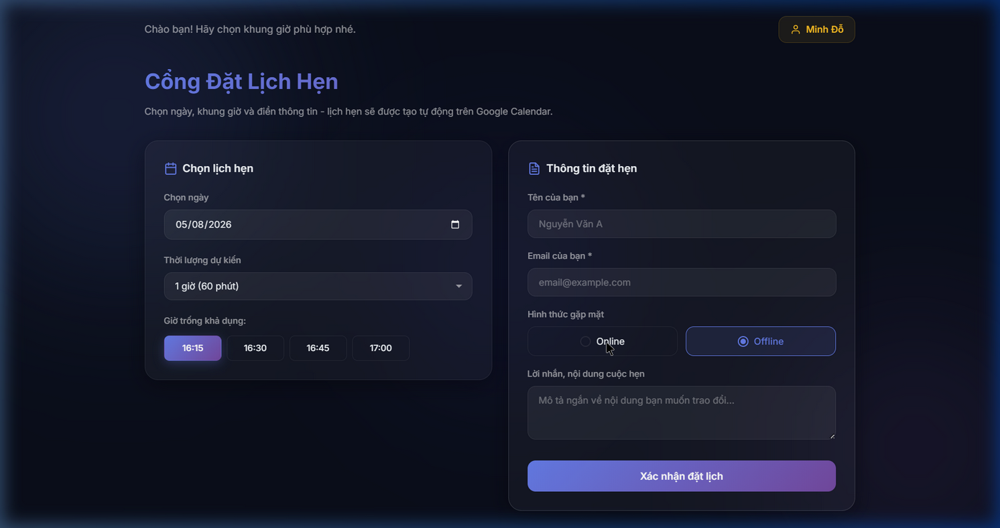

# 📅 Booking Calendar Generator

Hệ thống **Cổng Đặt Lịch Hẹn** tự động hoàn toàn miễn phí dành cho Solopreneur, Freelancer, Tư vấn viên. Được thiết kế với giao diện **Dark Glassmorphism** cực kỳ sang trọng và chuyên nghiệp.

## ✨ Tính năng nổi bật
- 🎨 **Giao diện Cao cấp:** Thiết kế Dark Glassmorphism, animations mượt mà, responsive 100% (Mobile/Desktop).
- ⚡ **Hoạt động Độc lập (Serverless):** Host hoàn toàn trên Vercel (miễn phí), không cần thuê server riêng.
- 📆 **Tích hợp Google Calendar:** Tự động tạo sự kiện trên lịch và gửi email (có kèm link Google Meet) cho khách hàng ngay lập tức.
- 🕒 **Thông minh & Tinh gọn:** Tự động ẩn các khung giờ đã qua trong ngày, tự động loại trừ giờ nghỉ trưa.
- 📊 **Log Dữ liệu:** Tự động ghi lại thông tin khách hàng vào Google Sheets.

## 🚀 Hướng dẫn Cài đặt & Sử dụng
Tham khảo chi tiết các bước setup tại [SKILL.md](./SKILL.md) (Hướng dẫn tự động hóa với Antigravity Agent).

### Dành cho Lập trình viên thủ công:
1. **Frontend:** Clone code, thay đổi thông tin cá nhân trong `index.html` và deploy lên Vercel.
2. **Backend:**
   - Tạo một project mới trên [Google Apps Script](https://script.google.com/).
   - Copy nội dung trong thư mục `apps-script/` (`Code.gs` và `appsscript.json`) vào project của bạn.
   - Thay `CALENDAR_ID` và `SPREADSHEET_ID` trong `Code.gs`.
   - Bấm **Deploy > New Deployment > Web App** (Chọn *Execute as: Me*, *Who has access: Anyone*).
   - Copy **Web App URL** và dán vào biến `CONFIG.BACKEND_URL` trong file `app.js` ở Frontend.
   - **Quan trọng:** Bạn PHẢI mở `Code.gs`, chọn hàm `doGet` và bấm Run một lần để cấp quyền cho Script, nếu không API sẽ báo lỗi 403.

## 🤝 Đóng góp (Contributing)
Mọi đóng góp, báo lỗi (issues) và pull requests (PRs) đều được chào đón! Vui lòng đọc kỹ [CONTRIBUTING.md](./CONTRIBUTING.md) trước khi đóng góp.

## 📄 Giấy phép (License)
Dự án được phân phối dưới giấy phép **MIT**. Xem file [LICENSE](./LICENSE) để biết thêm chi tiết.
"# Added test comment for PR review testing"  
""  
